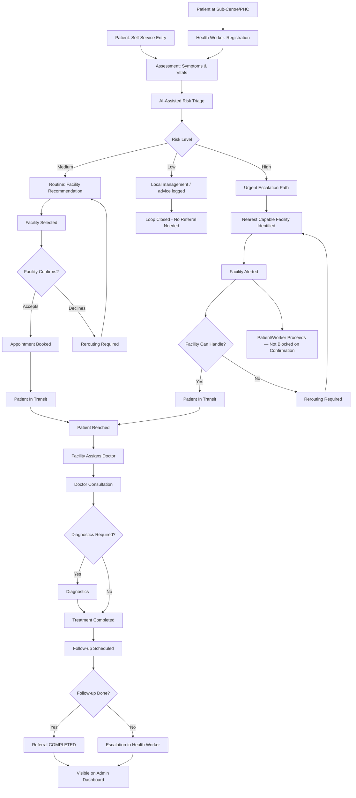
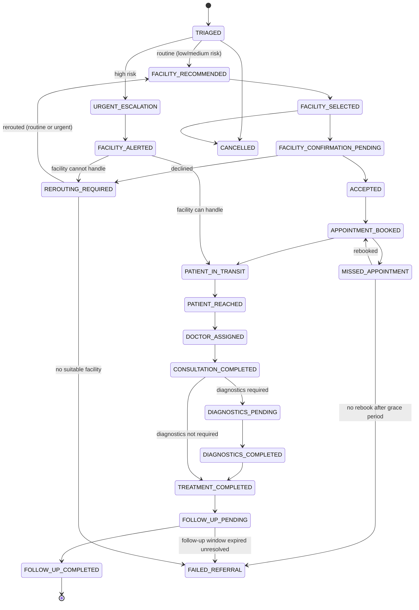

# MVP — Rural Healthcare Coordination Platform

**Problem Statement ID:** 26133 | **Organization:** Government of Maharashtra (MSInS) | **Theme:** MedTech / HealthTech
**Product Working Name:** SwasthyaSetu — AI-Assisted Rural Healthcare Coordination & Closed-Loop Referral Platform

---

## 1. MVP Objective

The MVP exists to prove one thing above all else: **that a referral raised — whether by a health worker or by the patient themself — can be tracked, end-to-end, until it is actually resolved**, and that it is always routed to a **facility that can currently handle it**, not just a facility that theoretically could.

Today, when a patient is referred to a higher facility, the system's job usually ends at the point of referral. Whether the patient reached the facility, was seen by a doctor, completed diagnostics, or came back for follow-up is invisible. This remains the single biggest gap the MVP targets.

The MVP therefore proves five things:
1. A patient can be assessed either **through a Health Worker** (primary route, works fully offline) or **through Patient Self-Service** (for capable, literate patients), and get an AI-assisted risk triage in either case.
2. The system recommends an appropriate **facility** — never an individual doctor — using both facility capability and real-time operational availability, and creates a referral **tracked as a state machine**.
3. A selected facility internally assigns an available, eligible doctor; the referring user never has to identify a specific doctor themselves.
4. A high-risk/emergency case is escalated and a capable facility alerted **without waiting for routine appointment confirmation** — including when the Health Worker has no connectivity at all.
5. A doctor can consult, prescribe, and close the loop, with follow-up reminders generated automatically — and an admin can see referral completion rates, reroutes, and failures on a dashboard.

It does **not** attempt to prove clinical accuracy of AI diagnosis (there is none), guaranteed emergency response, nationwide scale, or real integration with ABDM/eSanjeevani.

## 2. Core User Journey



**Offline variant:** when the Health Worker has no connectivity, Steps B–D happen locally; a High-risk result triggers the offline-emergency path (Section 7a) instead of a live facility lookup, using the best cached facility data with a clear "not live-verified" indicator, then queues for sync.

## 3. User Roles

### Patient
- **Goals:** Get seen quickly, understand what to do next, avoid unnecessary travel, retain control over who else sees their information.
- **Permissions:** View/manage own profile; **self-service route:** describe symptoms, view AI-assisted risk output (plain-language, non-diagnostic), view recommended facilities, request/track a referral, view own referral/appointment status, receive reminders. **Assisted route:** same outcomes, mediated through a Health Worker.
- **Actions (MVP):** Register (self or via Health Worker) → describe symptoms → view recommendation → track referral status → view follow-up.
- **Cannot do:** Override AI risk output, view other patients' data, see internal facility/doctor operational detail, receive a diagnosis.

### Caregiver *(new — modeled as a patient-authorized relationship, not an independent clinical role; see Section 3a)*
- **Goals:** Help a patient with low digital literacy or reduced capacity manage their care logistics.
- **Permissions:** Only what the patient explicitly authorizes — typically appointment status, reminders, and a limited status view. Never full clinical record access by default.
- **Actions:** View authorized status, receive reminders, assist with follow-up scheduling on the patient's behalf where authorized.

### Health Worker (ASHA / ANM / PHC staff)
- **Goals:** Register patients quickly, get a clear triage signal, refer confidently to a capable facility, track their patients' outcomes — with or without connectivity.
- **Permissions:** Create/view patients in their facility/catchment, run assessments, view AI triage, create referrals to facilities, view referral status, receive follow-up alerts.
- **Actions:** Register patient → capture vitals/symptoms (text or voice, online or offline) → view triage result → confirm/override → select facility → track referral status → handle offline-emergency path when needed.

### Doctor (PHC / Rural Hospital / District Hospital)
- **Goals:** See relevant patient context before consultation, record outcomes efficiently, close the referral loop — without needing to search the network for cases.
- **Permissions:** View referrals **assigned to them** by their facility (and unassigned facility-level referrals if authorized to view the queue), view patient longitudinal summary (within facility/consent scope), record consultation, issue digital prescription, order diagnostics, mark referral outcome, set their own availability status.
- **Actions:** Review assigned referral → consult → prescribe → order diagnostics → mark consultation complete → schedule follow-up.

### Facility Staff / Coordinator *(new, lightweight — see Section 3b)*
- **Goals:** Keep the facility's operational picture accurate so the recommendation engine and referring users see the truth.
- **Permissions:** Update facility operational status (open/limited/emergency-only/closed), update doctor availability/schedule for their facility, accept/decline incoming referrals at the facility level, assign an appropriate doctor, confirm patient arrival.
- **Actions:** Manage facility availability → triage incoming referral queue → assign doctor → mark patient arrival.

### Admin (District / State level, MSInS oversight)
- **Goals:** Monitor referral completion, identify bottleneck facilities, track high-risk patient follow-up, and see where the system is failing (reroutes, stale data, missed appointments).
- **Permissions:** Read-only dashboards across facilities in their jurisdiction; no patient-identifiable clinical data beyond what's needed for oversight (role-based, aggregated where possible).
- **Actions:** View dashboards, filter by facility/time period, export summary reports.

### 3a. Caregiver Design Decision

**Decision: model Caregiver as a patient-authorized relationship, not a separate independent account type in the core data model, to avoid unnecessary MVP complexity.**

A Caregiver is a `User` who is granted a scoped, revocable authorization against a specific `Patient` record — similar in shape to an OAuth-style consent grant, not a new clinical role with its own permission tree. This is simpler to build (one authorization table, reused RBAC checks) and simpler to reason about for privacy (every caregiver view is provably tied to an explicit, patient-granted, revocable scope) than a parallel role hierarchy would be. If a genuine need for multi-caregiver coordination or clinical-level caregiver permissions emerges post-MVP, this can be extended without a data-model rewrite.

### 3b. Facility Staff Design Decision

**Decision: introduce a lightweight Facility Staff/Coordinator role, because the facility-centric referral model requires someone to own facility-level operational truth (availability, doctor assignment, referral intake) — this cannot correctly fall to an individual Doctor without creating exactly the doctor-centric bottleneck this revision is meant to remove.**

The role is deliberately narrow: it manages availability and assignment, not billing, inventory, or beds. Where a facility is small enough that the Doctor and Facility Staff are the same person in practice, the same account can hold both permission sets — no separate account is mandatory.

## 4. MVP Features

### Must Have (P0)

| Feature | Purpose | User | Inputs | Processing | Outputs | Acceptance Criteria | Priority |
|---|---|---|---|---|---|---|---|
| Patient Registration (assisted) | Create a durable patient identity | Health Worker | Name, age, gender, phone, address, ID-optional | Deduplication check | Patient record with unique ID | Created in <30s; duplicate warning if match found | P0 |
| Patient Self-Registration | Let a capable patient create their own profile | Patient | Same fields, self-entered | Same deduplication check | Patient record | Patient can register without a health worker present | P0 |
| Symptom/Vitals Assessment | Capture structured clinical input | Health Worker or Patient | Symptoms (voice/text), vitals | Structured form + optional speech-to-text | Assessment record | Saved and retrievable; works with partial data | P0 |
| AI-Assisted Risk Triage | Decision support, not diagnosis | Health Worker/Doctor/Patient | Assessment data | Rule-based + ML risk scoring | Risk level + flagged factors (clinical wording for staff, plain wording for patients) | Disclaimer always shown; only staff can override | P0 |
| Facility-Centric Smart Recommendation | Suggest best-fit **facility** | Health Worker/Patient | Risk level, location, required specialty | Two-stage scoring incl. real-time availability | Ranked list of 1–3 **facilities**, never named doctors | Returned in <5s; freshness indicator shown; manual override allowed | P0 |
| Referral Creation (facility-centric) | Formalize a referral to a facility | Health Worker/Patient | Selected facility, patient, reason, risk level | Creates referral in `FACILITY_SELECTED` | Referral ID, facility-scoped status | Visible to facility queue immediately or on sync | P0 |
| Internal Doctor Assignment | Facility assigns eligible doctor | Facility Staff/System rule | Referral, doctor availability | Match by specialty + availability | Assigned doctor on referral | Doctor cannot be assigned if unavailable | P0 |
| Doctor/Facility Availability | Real-time operational picture | Doctor/Facility Staff | Status updates | Status + timestamp stored | Availability + freshness indicator | Stale data (beyond threshold) flagged in UI | P0 |
| Appointment Management | Book/track appointment slot | Health Worker/Patient/Facility Staff | Facility, date/time preference | Atomic slot allocation | Appointment confirmation | No double-booking; conflicts rejected safely | P0 |
| Urgent Escalation Flow | Ensure emergency cases aren't blocked | Health Worker/Patient | High-risk triage | Nearest-capable-facility lookup + alert | Facility alerted, user instructed to proceed | Escalation does not wait on routine appointment acceptance | P0 |
| Offline Capture + Offline-Emergency | Health Worker works with no connectivity | Health Worker | Registration/assessment/referral data | Local storage + outbox queue | Locally-stored record, `PENDING_SYNC` referral | Emergency case never blocked waiting for connectivity | P0 |
| Doctor Dashboard | Show assigned referrals | Doctor | Facility ID | Filter by status/urgency | List of assigned/queued referrals | Doctor sees only assigned/facility-scoped referrals, sorted by urgency | P0 |
| Consultation + Digital Prescription | Record outcome of visit | Doctor | Diagnosis notes, prescription items | Structured record creation | Prescription record, consultation note | Prescription downloadable/printable; linked to referral | P0 |
| Referral Status Tracking (Closed-Loop) | Track referral through all states | All roles (scoped) | State transitions | State machine enforcement | Current + historical referral state, plain-language patient view | Every transition logged with timestamp and actor | P0 |
| Follow-up Reminders | Ensure continuity post-consultation | Health Worker/Patient (if authorized) | Follow-up date | Scheduled notification job | Reminder; in-app fallback if push fails | Reminder fires on schedule; missed follow-up flagged after grace period | P0 |
| Caregiver Authorization | Scoped family-assisted access | Patient/Caregiver | Patient grants scope | Authorization record | Caregiver sees only authorized scope | Revocation is immediate and logged | P0 |
| Basic Admin Dashboard | Oversight of system health | Admin | Facility/date filters | Aggregation queries | Completion %, avg time, reroute/failure counts | Loads in <3s for a district-level dataset | P0 |
| Authentication & RBAC | Secure, role-appropriate access | All | Credentials | JWT-based auth | Session token, role-scoped access | Enforced server-side, never trusted from client | P0 |

### Should Have (P1)

| Feature | Purpose | User | Priority |
|---|---|---|---|
| Multilingual UI (Hindi, Marathi, English) | Reduce language barrier | All | P1 |
| Voice input for symptoms | Support low-literacy users | Health Worker/Patient | P1 |
| Hardened offline sync conflict UX | Safer merge behavior beyond MVP baseline | Health Worker | P1 |
| Facility diagnostic/medicine availability visibility | Reduce wasted trips | Health Worker/Patient | P1 |
| SMS notification fallback | Improve reach when push fails | Patient/Health Worker | P1 |
| Facility Staff tooling depth (bulk schedule updates) | Reduce operational overhead | Facility Staff | P1 |

### Nice to Have (P2)

| Feature | Purpose | Priority |
|---|---|---|
| Facility performance leaderboard (internal, non-punitive) | Encourage completion | P2 |
| Basic chronic-disease follow-up cohort view (maternal/child/NCD) | Targeted continuity | P2 |
| Map-based facility visualization (OSM) | Visual facility discovery | P2 |
| Multi-caregiver coordination (more than one authorized caregiver) | Broader family support | P2 |

### Future

- Assisted teleconsultation (basic)
- Real ABDM/eSanjeevani integration
- Predictive medicine-demand analytics

## 5. AI Triage

**Inputs:** Structured vitals (BP, temperature, pulse, SpO2 where available), patient-reported/health-worker-reported symptoms, age, gender, and relevant history flags (pregnancy, known chronic condition). Identical inputs whether the entry route is Health-Worker-assisted or Patient Self-Service.

**Model purpose:** The AI module performs **risk stratification and decision support only**. It estimates how urgently a patient likely needs escalation to a higher level of care, and highlights which reported symptoms/vitals drove that estimate. It is explicitly **not** a diagnostic system, and it also contributes an urgency classification (routine vs. requires escalation) consumed by the referral engine.

**Output:** A risk level — `LOW`, `MEDIUM`, or `HIGH` — accompanied by:
- The specific flagged inputs that contributed most (explainability)
- A suggested next action ("local management," "refer for consultation," "refer urgently")
- A confidence indicator where feasible
- **Output framing differs by audience:** clinical/technical wording for Health Worker and Doctor; plain, non-diagnostic wording for a self-service Patient (Section 10 of PRD).

**Risk levels and suggested handling:**
- **LOW** — manageable at current facility level; advice logged, no mandatory referral.
- **MEDIUM** — routine referral path; recommend consultation within a defined window (e.g., 48–72 hours).
- **HIGH** — urgent escalation path; nearest capable facility identified and alerted; flagged prominently on all dashboards.

**Safety boundaries:**
- The system never outputs a disease name or diagnosis, to any audience.
- Every triage output carries a visible disclaimer appropriate to the audience.
- The model is tuned to be conservative — designed to over-refer rather than under-refer borderline cases.
- A self-service Patient cannot override the AI output; only Health Worker/Doctor can, with a mandatory logged reason.

## 6. Facility-Centric Referral Engine (Two-Stage Matching)

### Stage 1 — Facility Recommendation

Facilities are ranked using a weighted scoring model combining objective, available factors — **preserving the existing scoring foundation**, extended with real-time operational availability:

```
Score(facility) =
      w1 * SpecialtyMatch(facility, required_specialty)
    + w2 * (1 / (1 + Distance(patient, facility)))
    + w3 * DiagnosticAvailability(facility, required_tests)
    + w4 * AppointmentAvailability(facility, urgency_window)
    + w5 * FacilityCapabilityLevel(facility, risk_level)
    + w6 * OperationalAvailability(facility, required_specialty)   -- NEW
    - w7 * CurrentLoadPenalty(facility)
    - w8 * StalenessPenalty(facility.last_verified_at)              -- NEW

Where:
  SpecialtyMatch          ∈ {0, 1}          -- facility has the required specialty/dept (capability)
  Distance                 = travel distance in km (OSRM if reachable, haversine fallback by default)
  DiagnosticAvailability   ∈ [0, 1]          -- fraction of required tests currently available
  AppointmentAvailability  ∈ {0, 1}          -- routine slot available within urgency window
  FacilityCapabilityLevel  ∈ {0, 1}          -- facility tier matches risk severity
  OperationalAvailability  ∈ {0, 1}          -- an eligible doctor is *currently* available for the specialty, right now
  CurrentLoadPenalty        = normalized current queue length at facility
  StalenessPenalty          = 0 if verified within threshold, rising otherwise

Weights (illustrative, config-driven): w1=0.25, w2=0.15, w3=0.15, w4=0.10, w5=0.15, w6=0.15, w7=0.03, w8=0.02
```

**Key change from the prior version:** `FacilityCapabilityLevel` alone (facility theoretically able to treat) is no longer treated as equivalent to the facility being able to treat the patient *right now*. `OperationalAvailability` is a separate factor, and a facility can score well on capability while scoring poorly on operational availability — e.g., "has an obstetrician on staff" (capability) vs. "obstetrician currently on duty" (operational availability).

The top 1–3 ranked **facilities** are shown to the user, who makes the final selection — the system recommends, it does not auto-assign a facility, preserving human judgment and local knowledge.

### Stage 2 — Internal Doctor Assignment

Facility acceptance (`ACCEPTED`) only confirms the facility can receive the case — it does not itself assign a doctor. Once the patient has actually reached the facility (`PATIENT_REACHED`), the facility (via Facility Staff, or an automated eligible-doctor rule where the facility is small) assigns the most appropriate **available** doctor:

```
function assignDoctor(facility, requiredSpecialty, urgency):
    eligible = getDoctors(facility, specialty=requiredSpecialty, status=AVAILABLE)
    if eligible is empty:
        eligible = getDoctors(facility, specialty=requiredSpecialty, status=EMERGENCY_ONLY) if urgency == HIGH
    if eligible is empty:
        return NO_ELIGIBLE_DOCTOR  -- triggers REROUTING_REQUIRED at the facility level
    return leastLoadedDoctor(eligible)
```

The referring Health Worker or Patient never needs to see this step — they see only "Facility confirmed" and, once assigned, "Dr. [Name] will see you," never a doctor-selection screen of their own.

## 7. Doctor Availability Model

| Status | Meaning | Effect on matching |
|---|---|---|
| `AVAILABLE` | On duty, taking new cases | Eligible for assignment |
| `BUSY_LIMITED` | On duty, limited new-case capacity | Eligible only if no `AVAILABLE` doctor exists |
| `EMERGENCY_ONLY` | On duty, accepting urgent cases only | Eligible only for `HIGH`-risk/urgent referrals |
| `ON_LEAVE` | Scheduled absence | Not eligible |
| `OFFLINE` | Off duty / unreachable | Not eligible |

The system never encourages a user to wait for or contact a specific unavailable doctor. If no eligible doctor exists at the selected facility, the referral surfaces "No eligible doctor is currently available here" and either shows the next available slot (routine) or triggers `REROUTING_REQUIRED` (urgent).

## 7a. Facility Operational Availability

Distinct from **Facility Capability** (can this facility ever treat this condition — a static/slow-changing property) is **Operational Availability** (can it do so right now, within the urgency window — a fast-changing property). A facility exposes an aggregate status to the referring user, e.g.:

```
District Hospital
  Obstetrics: Available (doctor on duty)
  Laboratory: Available
  Emergency capability: Available
  Next suitable doctor: 9:30 AM (if none currently on duty)
  Availability last verified: 18 minutes ago
```

A facility can simultaneously have: required specialty but no doctor on duty; doctor available but diagnostics down; both available but capacity exhausted; or be temporarily closed for routine visits while still accepting emergencies. The recommendation engine treats these as distinct signals, never collapsing "facility exists in the directory" into "facility can currently handle this patient."

## 7b. Routine vs. Urgent/Emergency Flow

**Routine (Low/Medium risk):**
`Facility Recommended → Facility Selected → Facility Confirmation Pending → Accepted → Appointment Booked → Patient In Transit → Patient Reached → Doctor Assigned → Consultation`
If the facility cannot accept: explain why, deprioritize/exclude it, mark the referral `REROUTING_REQUIRED`, recommend the next facility, notify the referring user, preserve the audit trail.

**Urgent/Emergency (High risk):**
`TRIAGED → URGENT_ESCALATION → nearest capable facility identified → FACILITY_ALERTED → user proceeds without waiting for confirmation → Patient In Transit → Patient Reached → Doctor Assigned → Consultation`
A high-risk case branches directly from triage into urgent routing — it does not first pass through routine Facility Recommendation/Facility Selection. The system prioritizes immediate escalation over appointment convenience. It never claims to guarantee emergency care, never claims an online appointment is a prerequisite for emergency treatment, and never claims to replace emergency services — it accelerates and documents the referral, nothing more. If the alerted facility cannot handle the case, the referral is marked `REROUTING_REQUIRED` and the next capable facility is identified — this is an operational-failure branch, not a re-classification of urgency; the case remains urgent throughout.

## 7c. Offline-First Health Worker Mode

The Health Worker app supports, fully offline: patient registration, patient lookup against locally cached records, assessment capture, vitals/symptom entry, preliminary rule-based triage (the deterministic danger-sign layer, which does not require network), referral preparation, viewing cached facility information, and viewing previously-synced referral status.

**Offline emergency scenario:** Health Worker has no internet; patient is assessed as High-risk. The app: (1) saves all clinical data locally, (2) generates a locally-unique temporary correlation ID, (3) marks the case `PENDING_SYNC`, (4) shows the best cached facility recommendation with a clearly labeled "availability could not be verified live" warning, (5) instructs the worker that care should not be delayed waiting for connectivity, (6) queues the referral for sync. On reconnection: the server assigns the canonical referral ID, reconciles against current live state, and notifies the receiving facility.

**Offline data security:** locally cached clinical data is encrypted at rest on-device; app sessions auto-lock after inactivity; only the minimum necessary cached data is retained (recent/active patients, not the full district); if a device is lost, cached data is inaccessible without re-authentication and is time-bound for expiry; all offline-created records remain in the audit trail once synced.

**Sync conflicts:** the server is the source of truth for referral-critical fields (e.g., current referral state). A stale offline state is never silently overwritten onto the server, nor does the server silently discard the worker's offline actions — the app surfaces a reconciliation prompt when a referral-critical field has diverged (e.g., a facility accepted the referral online while the worker still shows it as pending offline).

## 8. Closed-Loop Referral State Machine

This is the single canonical referral state diagram for the MVP. `CREATED` is **not** a referral state and does not appear in this state machine — it is used elsewhere only as a generic record-creation concept (e.g., a `Patient` record being created), which is a distinct thing from referral status. The referral lifecycle begins at `TRIAGED`.



**State definitions:**
- `TRIAGED` — assessment complete, AI risk output produced. This is the entry point of the referral state machine; a referral doesn't yet target a facility, and no separate `CREATED` referral state precedes it.
- `FACILITY_RECOMMENDED` — ranked facility options generated/shown (routine path only).
- `FACILITY_SELECTED` — user has chosen a facility for a routine case (destination is a **facility**, not a doctor).
- `FACILITY_CONFIRMATION_PENDING` — facility has been asked to confirm it can receive/handle this referral. This confirms facility-level capacity only — it does **not** mean a specific doctor has been assigned.
- `ACCEPTED` — facility has confirmed it can take the case (facility-level acceptance; doctor assignment happens later, after the patient reaches the facility).
- `APPOINTMENT_BOOKED` — a specific date/time slot is reserved.
- `URGENT_ESCALATION` — High-risk case, branching directly from `TRIAGED` and bypassing routine facility recommendation/confirmation entirely so care is never delayed. It is a triage-time pathway only. Clinical deterioration discovered **after** `ACCEPTED` is deliberately **not** modeled as an `ACCEPTED → URGENT_ESCALATION` transition — instead it is logged as a `REFERRAL_EVENTS` entry (e.g. `CLINICAL_DETERIORATION_FLAGGED`) that triggers human/facility action, keeping clinical urgency (this event) clearly distinct from operational facility failure (`REROUTING_REQUIRED`).
- `FACILITY_ALERTED` — nearest capable facility has been notified of an incoming urgent case.
- `REROUTING_REQUIRED` — an operational-failure state: the selected/alerted facility declined, became unavailable, or had no eligible doctor, so the system must recalculate. Whether the original referral was routine or urgent, rerouting funnels back through `FACILITY_RECOMMENDED` for re-scoring against remaining facilities; a failed facility match is never automatically treated as a new `URGENT_ESCALATION`. If no suitable facility can be found, the referral moves to `FAILED_REFERRAL`.
- `PATIENT_IN_TRANSIT` — the appointment is booked (routine) or the facility has been alerted and accepted (urgent), and the patient is travelling toward the facility, but has not yet arrived. This distinguishes "appointment booked" from "patient travelling" from "patient has arrived."
- `PATIENT_REACHED` — facility confirms patient physically arrived.
- `DOCTOR_ASSIGNED` — facility has internally assigned an eligible, available doctor (Stage 2 matching), occurring **after** `PATIENT_REACHED`. The referral is facility-centric: the receiving facility decides which eligible doctor/service handles the patient, and the individual doctor is never the referral destination.
- `CONSULTATION_COMPLETED` — doctor has recorded a consultation.
- `DIAGNOSTICS_PENDING` / `DIAGNOSTICS_COMPLETED` — ordered tests awaited / results logged. Diagnostics are **optional**, not mandatory for every patient: if the doctor determines diagnostics are required, the referral moves through this pair of states before `TREATMENT_COMPLETED`; if not required, the referral moves directly from `CONSULTATION_COMPLETED` to `TREATMENT_COMPLETED`.
- `TREATMENT_COMPLETED` — prescription/treatment plan issued.
- `FOLLOW_UP_PENDING` — a follow-up date is scheduled and awaited.
- `FOLLOW_UP_COMPLETED` — follow-up confirmed done; referral closes successfully.
- `CANCELLED` — referral withdrawn before facility selection, or after facility selection if the patient no longer needs care (e.g., patient improved or sought care elsewhere).
- `MISSED_APPOINTMENT` — patient did not arrive at scheduled time; triggers alert for rebooking.
- `FAILED_REFERRAL` — terminal failure state reached when: (a) a `MISSED_APPOINTMENT` is not rebooked within the grace period, (b) a `FOLLOW_UP_PENDING` case is unresolved beyond threshold, or (c) `REROUTING_REQUIRED` cannot find any suitable facility; visible on admin dashboard.

Every transition is timestamped and attributed to an actor (health worker, patient, doctor, facility staff, or system-automated on timeout), forming the audit trail that powers the closed-loop metrics. Offline-originated transitions carry a `PENDING_SYNC` flag until reconciled with the server.

## 9. MVP Screens

| # | Screen | Purpose | Key UI Components | Actions | Data Displayed |
|---|---|---|---|---|---|
| 1 | Login / Role Select | Role-based authentication | Username/password or OTP, role picker | Login | — |
| 2 | Health Worker Home | Entry point for daily work | Patient list, "New Patient" button, offline indicator, alerts | Navigate, create patient | Recent patients, pending follow-ups, sync status |
| 3 | Patient Self-Service Home | Entry point for self-service | "Describe symptoms" button, my referrals, reminders | Navigate | Own status, upcoming appointment |
| 4 | Patient/Caregiver Registration | Capture patient identity | Form fields, duplicate-check banner | Save patient | New/matched patient record |
| 5 | Assessment / Vitals Entry | Capture symptoms & vitals | Vitals form, symptom checklist, voice-input button | Save assessment | Current + historical vitals |
| 6 | AI Triage Result | Show risk output | Risk badge, flagged factors, disclaimer, override button (staff only) | Accept/override, proceed | Risk level, contributing factors (audience-appropriate wording) |
| 7 | Facility Recommendation | Show ranked **facilities** | Facility cards with plain-language "why," freshness indicator, map optional | Select facility | Distance, specialty, operational availability |
| 8 | Referral Confirmation | Confirm referral details | Summary form | Submit referral | Patient, facility, reason, urgency |
| 9 | Appointment Booking | Pick a slot | Calendar/slot picker | Confirm slot | Available slots |
| 10 | Urgent Escalation Screen | Guide user through emergency path | Alert banner, facility-alerted confirmation, next-steps instructions | Acknowledge, proceed | Nearest capable facility, alert status |
| 11 | Referral Tracking (Patient/Health Worker view) | Monitor referral in plain language | Status timeline, filter | View, escalate | Referral state history (plain-language) |
| 12 | Facility Coordinator Dashboard | Manage facility operations | Referral intake queue, doctor availability grid, appointment capacity | Accept/decline, assign doctor, update availability | Incoming referrals, doctor status |
| 13 | Doctor Dashboard | Manage assigned referrals | Referral queue sorted by urgency, own availability toggle | Set availability, open patient | List of assigned referrals, risk flags |
| 14 | Patient Summary (Doctor view) | Pre-consult context | Longitudinal record snippet, current triage | View | Assessment history, vitals trend |
| 15 | Consultation & Prescription | Record visit outcome | Notes field, prescription builder, diagnostics order | Save, generate prescription | Consultation record |
| 16 | Follow-up Scheduler | Set next check-in | Date picker, reason | Schedule | Follow-up date |
| 17 | Caregiver Access Management | Grant/revoke caregiver scope | Scope checklist, revoke button | Authorize, revoke | Current authorizations |
| 18 | Admin Dashboard | System-wide oversight | Charts: completion %, avg time, reroutes, high-risk trend | Filter by facility/date | Aggregated KPIs |
| 19 | Facility/Referral Detail (Admin) | Drill into a specific facility or case | Table/detail view | View, export | Referral list, status breakdown |

## 10. MVP Demo Scenario — "Meena's Journey"

**"Meena's Journey" — a pregnant woman in a rural sub-centre catchment area, demonstrating the offline-emergency path.**

1. Meena, 27, 32 weeks pregnant, visits her local sub-centre with dizziness and swelling in her feet. The ASHA worker's app has **no connectivity** today. She registers Meena locally (existing patient found via cached record — two prior antenatal visits).
2. Health worker records vitals: BP 148/96, mild pedal edema, symptoms via voice input in Marathi — all captured locally.
3. The offline rule-based danger-sign layer flags **HIGH risk** immediately (elevated BP + edema in pregnancy is a recognized danger-sign pattern) — no network needed for this safety-critical step.
4. The app shows the best **cached** facility recommendation — District Hospital (has obstetrics + lab) — clearly labeled **"Availability could not be verified live — based on last sync."** The worker is instructed not to delay Meena's travel waiting for connectivity.
5. The referral is saved locally as `PENDING_SYNC` with a temporary correlation ID; the worker sends Meena toward the district hospital immediately — the referral is now conceptually `PATIENT_IN_TRANSIT`, even before the state can be confirmed with the server.
6. En route, connectivity returns. The app syncs: the server assigns the canonical referral ID, confirms District Hospital's obstetrics is genuinely on duty right now, marks the referral `URGENT_ESCALATION → FACILITY_ALERTED → PATIENT_IN_TRANSIT`, and notifies the hospital.
7. Meena arrives; front-desk (Facility Staff) marks `PATIENT_REACHED`, and only then assigns her to the on-duty obstetrician (`DOCTOR_ASSIGNED`) — the ASHA worker never had to know or choose which doctor, and no doctor was assigned before Meena physically arrived.
8. The obstetrician consults (`CONSULTATION_COMPLETED`), determines diagnostics are required, and orders urine protein + blood tests (`DIAGNOSTICS_PENDING` → `DIAGNOSTICS_COMPLETED` once logged), prescribes medication and rest (`TREATMENT_COMPLETED`), and schedules a follow-up in 5 days.
9. Five days later, a follow-up reminder reaches the ASHA worker (and, since Meena authorized it, her husband as caregiver); Meena is checked at the sub-centre, BP normalized, referral marked `FOLLOW_UP_COMPLETED`.
10. The district admin dashboard shows this case contributing to the "maternal high-risk follow-up completion rate" KPI, and separately logs that this referral originated offline and was successfully reconciled — demonstrating the full closed loop under a real rural connectivity constraint, not an idealized always-online scenario.

This scenario demonstrates offline capture, offline danger-sign triage, offline-emergency handling, sync reconciliation, facility-centric (not doctor-named) referral, internal doctor assignment, consultation, diagnostics, prescription, follow-up, caregiver notification, and dashboard visibility — the entire MVP in one coherent, realistic story. It is intentionally not more elaborate than this; adding more branches to the live demo would trade clarity for spectacle.

## 11. Out of Scope

- Full national/state-wide healthcare network integration
- Real medical diagnosis or autonomous AI clinical decision-making, for any user including self-service patients
- Full hospital management system (billing, inventory management, bed management beyond basic availability flags)
- Nationwide or district-wide ambulance dispatch integration
- Full production ABDM integration (Health ID creation, live HIE-CM exchange) — only architecture-level readiness
- "Advanced AI doctor" / conversational diagnosis chatbot
- Blockchain-based record-keeping
- Unnecessary microservices split — MVP uses a modular monolith
- Real-time video teleconsultation infrastructure (a stretch goal, not core MVP)
- Multi-state deployment
- Independent Caregiver clinical role with unrestricted record access
- Full facility/hospital-management-grade staff scheduling tooling (Facility Staff role is availability + intake only)
- Guaranteed emergency response or ambulance-equivalent claims

## 12. MVP Success Metrics

| Metric | Definition | Target (Demo/Pilot Context) |
|---|---|---|
| Referral completion rate | % of referrals reaching `FOLLOW_UP_COMPLETED` or `TREATMENT_COMPLETED` | Demonstrable upward trend vs. baseline (baseline is qualitative/assumed, not fabricated) |
| Average referral processing time (routine) | Time from `FACILITY_SELECTED` to `APPOINTMENT_BOOKED` | < 24 hours in demo scenario |
| Average escalation time (urgent) | Time from `URGENT_ESCALATION` to `FACILITY_ALERTED` | < 2 minutes in demo scenario |
| Appointment booking time | Time from facility acceptance to confirmed slot | < 5 minutes in-app |
| Follow-up completion rate | % of `FOLLOW_UP_PENDING` reaching `FOLLOW_UP_COMPLETED` | Tracked and visible on dashboard |
| Reroute resolution | % of `REROUTING_REQUIRED` cases that reach a confirmed facility | Illustrated via demo scenario, not claimed as measured real-world result |
| Triage response time | Time from assessment submission to risk output (online or offline rule-based) | < 5 seconds |
| Offline-to-sync reconciliation time | Time from connectivity restoration to server-confirmed referral state | < 30 seconds in demo scenario |

*Note: All numeric targets above are MVP/demo design targets, not measured field results, and should be presented as such to judges.*

---

## Implementation Priority

1. Authentication/RBAC + Patient Registration (assisted and self-service) — foundation
2. Assessment capture + AI Triage (core value proposition, both entry routes)
3. Facility-centric Smart Recommendation + Referral Creation (differentiator)
4. Doctor/Facility availability model + two-stage matching + routine/urgent split
5. Closed-loop referral state machine + tracking (core differentiator — highest demo weight)
6. Offline-first capture + offline-emergency path (credibility for the rural-connectivity story)
7. Doctor/Facility Staff dashboards + Consultation + Prescription
8. Follow-up reminders + Caregiver access
9. Admin Dashboard (for judge-facing impact visibility)
10. Should-have items (multilingual, hardened sync, voice) as time permits before demo
