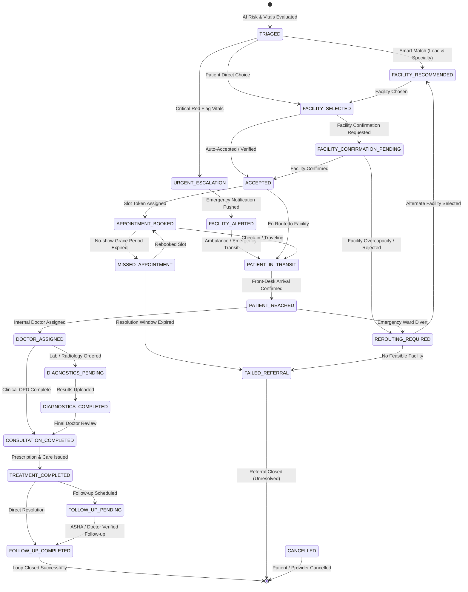

# 🏥 SwasthyaSetu (स्वास्थ्य सेतु) & HealthNexus Platform
> **AI-Assisted Rural Healthcare Coordination, 21-State Closed-Loop Referral Engine & Longitudinal Patient EHR Platform**  
> **Problem Statement ID:** 26133 | **Theme:** MedTech / HealthTech | **Smart India Hackathon 2026**  
> **Government of Maharashtra** — Maharashtra State Innovation Society (MSInS)

---

## 🌟 Overview & Core Differentiator

**SwasthyaSetu** addresses the single biggest systemic breakdown in rural public healthcare delivery: **the referral black hole**. In rural healthcare networks, patients frequently get referred between Sub-Centres (SC), Primary Health Centres (PHC), Community Health Centres (CHC), Sub-District Hospitals (SDH), and District Hospitals (DH) with fragmented physical paper slips and zero tracking of whether the patient ever reached the facility or received completed treatment.

SwasthyaSetu bridges this gap with an **offline-first, 21-state closed-loop referral state machine**, **smart capacity-aware facility matching**, **AI clinical risk triage with deterministic safety clamps**, **internal doctor queue assignment**, **longitudinal EHR & multimodal lab report summarization**, and **cryptographically verifiable SHA-256 audit chaining**.

---

## 🎯 User Personas & Dual-Entry Pathways

1. **Health Worker Assisted Route (ASHA / ANM)**:
   - Built for low-connectivity rural catchments with offline SQLite queuing and idempotent bi-directional sync.
   - Quick household patient registration, vitals logging, red-flag emergency escalation, and follow-up verification.
2. **Patient Self-Service Route**:
   - For smartphone users to self-register, describe symptoms, receive risk tiering, book slots at capable facilities, and track active referrals.
3. **Caregiver / Family Proxy Hub**:
   - Granular, revocable permissions (`APPOINTMENTS_ONLY`, `REPORTS_ONLY`, `FULL_ACCESS`) for family members managing elderly or dependent care, plus a 1-click Emergency SOS panic beacon.
4. **Facility Operations & Coordinator**:
   - Real-time facility operational load meters (bed and ICU capacity), availability updates, emergency bed alerts, and internal doctor assignments.
5. **Doctor Clinical OPD Portal**:
   - Triage queue management, longitudinal patient EHR access, Guardian AI drug-drug interaction safety checks, digitally signed prescriptions, and diagnostics ordering.
6. **Health Authority & MSInS Oversight**:
   - High-level KPI dashboards tracking referral completion rates, average transit times, bottleneck facilities, and cryptographic audit chains.

---

## 🔄 The Canonical 21-State Closed-Loop Referral Machine



---

## 🚀 Core Features Matrix

### 1. 📋 Closed-Loop Referral Lifecycle
- **21-State State Machine**: Invariant-enforced transitions covering routine, urgent emergency, overcapacity rerouting, cancellation, diagnostics, and follow-up loops.
- **Facility-Centric Routing**: Referrals target capable healthcare facilities; internal coordinators assign specific doctors based on real-time OPD loads.

### 2. 🏥 Smart Facility Matching & Availability Decay
- **Multi-Tier Directory**: Sub-Centres, PHCs, CHCs, Sub-District Hospitals, and District Hospitals.
- **Freshness-Aware Load Meter**: Dynamic operational load scoring (0–100%) incorporating time-based exponential decay when telemetry is older than 60 minutes.
- **24x7 Emergency Tagging**: Direct routing for trauma, high-risk pregnancy, and cardiac emergency cases.

### 3. 🤖 AI Clinical Decision Support & Safety Boundary
- **Clamped Vitals Triage**: Evaluates BP, SpO2, Heart Rate, Respiratory Rate, Temperature, and Pregnancy. Deterministic clinical rules guarantee critical red-flag vitals (e.g. SpO2 < 90%, BP > 180/110) cannot be downgraded by LLM outputs.
- **Zero Prescribing Authority**: AI microservice provides strictly educational summaries and differential decision support. All prescriptions require verified doctor sign-off.
- **Circuit Breaker Protection**: `AiCircuitBreaker` pattern prevents cascading backend failures when remote AI models face latency or outages, instantly falling back to local deterministic rule engines.

### 4. 📄 Longitudinal EHR & Prescription Safety
- **Multimodal Lab Report Summarizer**: OCR extraction and educational breakdown of lab values (Hb, WBC, Platelets, Sugar) with normal range comparisons.
- **Guardian AI Drug Interaction Check**: Cross-references prescribed medicines against known patient allergies and existing medications to flag contraindicated drug combinations.

### 5. 🔐 Cryptographic Ledger & Data Governance
- **SHA-256 Audit Chain**: Every state transition and clinical event creates an immutable block cryptographically linked to the previous block hash.
- **Role-Based Access Control (RBAC)**: Strict role separation across `patient`, `health_worker`, `caregiver`, `doctor`, `facility_staff`, `facility_coordinator`, and `admin`.

---

## 🛠️ Technology Stack

| Component | Technology | Description |
| :--- | :--- | :--- |
| **Backend API** | Node.js (v18+) + Express | Clean layered architecture (Controllers, Services, Domain, Repositories) |
| **Database & Identity** | Supabase (PostgreSQL 16) | UUID primary keys, Row Level Security, JSONB audit storage |
| **AI Microservice** | Python FastAPI / Gemini SDK | Clinical decision support, OCR extraction, circuit breaker wrapper |
| **Frontend Web** | React 19 + Vite + Tailwind CSS | Responsive web application for patients, doctors, and administrators |
| **Mobile Runtime** | Capacitor 8 | Native Android wrapper for field workers and patients |
| **Offline Cache** | SQLite / Local File System | Zero-data-loss queue for low-bandwidth rural operations |
| **API Documentation** | OpenAPI 3.0 (Swagger UI) | Interactive API exploration at `/api-docs` |

---

## ⚠️ Documented Boundaries & Known System Limitations

To ensure clear clinical and technical accountability:

1. **ABDM / eSanjeevani Integration Boundary**:
   - The platform provides ABDM/FHIR-compliant schema definitions, ABHA identifier capture, and standardized clinical data structures.
   - Live production calls to National Health Authority (NHA) ABDM and eSanjeevani gateways utilize simulated sandbox adaptors until production gateway approval and client certificates are provisioned.
2. **AI Decision Support Only (Zero Autonomous Authority)**:
   - All AI-generated triage scores, lab summaries, and interaction alerts serve solely as **Clinical Decision Support**.
   - The platform grants zero autonomous prescribing or diagnostic authority to AI models. Prescriptions and definitive diagnoses must be executed by registered medical practitioners.
3. **Cached Facility Availability & Decay**:
   - Facility bed and ICU occupancy levels rely on telemetry posted by facility coordinators.
   - When real-time data is older than 60 minutes, the recommendation engine applies exponential confidence decay to prioritize facilities with fresher operational telemetry.

---

## ⚡ Quick Start & Verification Guide

### 1. Prerequisites
- **Node.js**: v18+ (Node 20+ LTS recommended)
- **Git**

### 2. Installation
```bash
# Clone the repository
git clone https://github.com/MrAditya-Singh/Swasthya.git
cd Swasthya/backend

# Install backend dependencies
npm install
```

### 3. Environment Configuration
Copy the sample environment file and adjust keys if connecting to custom Supabase instances:
```bash
cp .env.example .env
```

### 4. Running the Complete Automated Test Suite
The repository includes 21 comprehensive test suites covering unit tests, integration failure injection, and multi-branch E2E workflows:
```bash
# Run all unit, integration, and E2E tests (21/21 suites)
npm test

# Run specific test suites
npm run test:unit
npm run test:integration
npm run test:e2e
```

### 5. Starting the Backend Server
```bash
npm start
# Server listening on http://localhost:8000
# OpenAPI Swagger Documentation available at http://localhost:8000/api-docs
```

---

## 🔍 Observability & Health Endpoints

| Endpoint | Method | Purpose |
| :--- | :--- | :--- |
| `GET /` | `GET` | API banner, version, and Swagger route reference |
| `GET /api/health` | `GET` | Comprehensive health check with Supabase DB latency probe, memory RSS, and uptime |
| `GET /api/health/ready` | `GET` | Cloud container readiness probe for zero-downtime deployments |
| `GET /api/ai/health` | `GET` | AI microservice latency probe and circuit breaker operational state |
| `GET /api-docs` | `GET` | Interactive OpenAPI 3.0 Swagger UI documentation |

---

## 📜 License & Acknowledgements
Developed for the **Smart India Hackathon 2026** (Problem Statement 26133) in collaboration with the **Government of Maharashtra** and **Maharashtra State Innovation Society (MSInS)**.
