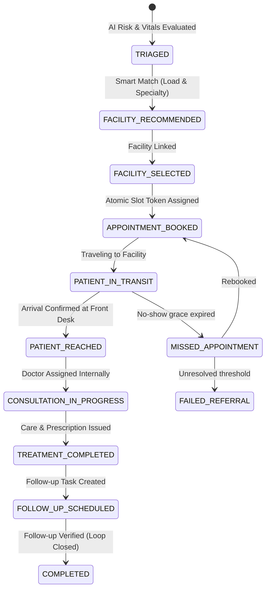

# 🏥 SwasthyaSetu (स्वास्थ्य सेतु) & HealthNexus Platform
> **AI-Assisted Rural Healthcare Coordination, Closed-Loop Referral Engine & Patient Health Record Platform**  
> **Problem Statement ID:** 26133 | **Theme:** MedTech / HealthTech | **Smart India Hackathon 2026**  
> **Government of Maharashtra** — Maharashtra State Innovation Society (MSInS)

---

## 🌟 Overview & Core Differentiator

**SwasthyaSetu** addresses the single biggest gap in rural public healthcare delivery: **the referral black hole**. In rural healthcare networks, patients frequently navigate between sub-centres, primary health centres (PHCs), rural hospitals, and district hospitals with fragmented medical records and zero accountability on whether referrals ever result in completed care.

SwasthyaSetu bridges this gap with an **offline-first, 13-state closed-loop referral engine**, **smart facility matching**, **AI-assisted clinical risk triage**, **internal doctor assignment**, **EHR & lab report interpretation**, and **cryptographic security audit logging**.

---

## 🎯 Dual-Entry Architecture & User Personas

1. **Health-Worker-Assisted Route (Primary)**:
   - Optimized for ASHA / ANM workers in low-connectivity rural catchments.
   - Quick patient registration, structured vitals capture, and offline-emergency escalation path.
2. **Patient Self-Service Route**:
   - For smartphone-equipped patients to self-register, describe symptoms, receive AI risk triage, find capable facilities, and track referrals independently.
3. **Caregiver-Authorized Relationship**:
   - Scoped, revocable access permissions (`APPOINTMENTS_ONLY`, `REPORTS_ONLY`, `FULL_ACCESS`) for family members assisting elderly or illiterate patients.
4. **Facility Staff & Coordinator**:
   - Manages real-time facility operational load, emergency availability, and internal doctor assignments.
5. **Doctor Consultation Portal**:
   - Review incoming referrals, access longitudinal patient EHR, issue digitally signed prescriptions, order diagnostics, and schedule follow-ups.
6. **Health Authority & MSInS Oversight**:
   - High-level KPI dashboard tracking referral completion rates, bottleneck facilities, and cryptographic audit chains.

---

## 🔄 The 13-State Closed-Loop Referral Machine



---

## 🚀 Key Features Matrix

### 1. 📋 Closed-Loop Referral & Tracking
- **13-State Machine**: Tracks patients from initial triage to verified follow-up closure.
- **Facility-Centric Routing**: Referrals are made to a capable **facility**, which internally assigns an available doctor.
- **Urgent vs Routine Paths**: High-risk emergencies bypass routine confirmation delays and alert the nearest capable hospital immediately.

### 2. 🏥 Smart Facility Matching & Availability
- **Multi-Tier Directory**: PHCs, CHCs, Sub-District, District, and Tertiary Hospitals.
- **Real-Time Operational Load Meter**: Displays current patient capacity (0–100%) and data-freshness timestamps.
- **24x7 Emergency Tagging**: Filter hospitals with immediate intensive/trauma care capabilities.

### 3. 🤖 AI Clinical Triage & Risk Stratification
- **Vital Sign Scoring**: Evaluates Systolic/Diastolic BP, SpO2, Pulse, Temperature, Respiration, and Pregnancy risk.
- **Explainable Factors**: Flags conditions such as *Severe Pre-eclampsia*, *Hypertensive Crisis*, and *Severe Hypoxia (SpO2 < 90%)*.
- **Decision Support Only**: Strict decision-support principles — no autonomous medical prescriptions.

### 4. 📄 Longitudinal EHR & Lab Report AI Analyzer
- **Multimodal AI Report Interpretation**: Gemini & MedGemma OCR and analysis for uploaded blood reports, scans, and PDFs.
- **Guardian AI Safety Check**: Cross-checks prescribed medications against patient allergy and chronic disease histories to prevent adverse drug interactions.
- **Visual Medicine Explainer**: Generates patient-friendly illustrated storyboards explaining medicine purpose and dosage for elderly patients.

### 5. 🔐 Cryptographic Security & Privacy
- **SHA-256 Audit Ledger**: Every referral state change and medical data modification is cryptographically hashed and linked to the previous log block.
- **Supabase PostgreSQL & Row Level Security (RLS)**: Fine-grained access control ensuring patients, doctors, and caregivers only access authorized records.
- **ABDM/FHIR Ready**: Structured data models designed for future ABHA and digital health mission interoperability.

---

## 🛠️ Technology Stack

| Layer | Technology |
| :--- | :--- |
| **Frontend** | React 19 + Vite 7, Lucide Icons, Framer Motion, Axios |
| **Mobile Shell** | Capacitor 8 (Android & Web) |
| **Backend API** | Node.js + Express (Modular Service Architecture) |
| **Database** | Supabase (PostgreSQL 16 with UUID & Crypto extensions) |
| **Authentication** | Supabase Auth (JWT + OTP Verification) |
| **Storage** | Supabase Storage (`medical-documents` bucket) + Local File Handler |
| **AI Runtime** | Google Gemini Generative AI SDK & Local Python MedGemma Service |

---

## 📂 Project Architecture

```
LabReportTracker/
├── backend/
│   ├── src/
│   │   ├── config/
│   │   │   └── supabaseClient.js      # Supabase Client configuration
│   │   ├── controllers/
│   │   │   ├── referralController.js    # 13-state referral machine logic
│   │   │   ├── facilityController.js    # Facility load & smart matching
│   │   │   ├── assessmentController.js  # Clinical vitals & AI triage
│   │   │   ├── adminController.js       # KPI oversight & audit ledger
│   │   │   ├── authController.js        # Supabase JWT authentication
│   │   │   ├── documentController.js    # Lab report upload & sharing
│   │   │   ├── doctorController.js      # Doctor dashboard & prescriptions
│   │   │   ├── familyController.js      # Family & caregiver linkage
│   │   │   └── aiController.js          # Drug safety check & explainers
│   │   ├── middleware/
│   │   │   └── auth.js                  # Supabase JWT middleware
│   │   ├── routes/                      # Express route definitions
│   │   ├── services/
│   │   │   ├── supabaseService.js       # Unified Supabase DB service
│   │   │   ├── aiService.js             # Gemini AI interpretation
│   │   │   └── pdfService.js            # Prescription PDF generator
│   │   └── server.js                    # Main Express API entrypoint
│   ├── supabase_schema.sql              # Supabase PostgreSQL schema
│   └── .env                             # Backend environment variables
│
├── frontend_react/
│   ├── src/
│   │   ├── config/
│   │   │   └── supabase.js              # Frontend Supabase SDK client
│   │   ├── context/
│   │   │   └── AuthContext.jsx          # Session & user context
│   │   ├── pages/
│   │   │   ├── ReferralTracker.jsx      # Closed-loop visual lifecycle
│   │   │   ├── FacilityFinder.jsx       # Public hospital matching
│   │   │   ├── TriageAssessment.jsx     # AI vitals risk evaluation
│   │   │   ├── AdminDashboard.jsx       # Health authority oversight & audit
│   │   │   ├── Home.jsx                 # Patient portal
│   │   │   ├── Services.jsx             # Healthcare service catalog
│   │   │   ├── Records.jsx              # Longitudinal EHR & reports
│   │   │   ├── FamilyHealth.jsx         # Caregiver & family health circle
│   │   │   ├── DoctorDashboard.jsx      # Doctor clinical workflow
│   │   │   ├── PrescribeMedicine.jsx    # Digital prescription issuer
│   │   │   └── LearnMedicines.jsx       # AI storyboard visual explainer
│   │   └── App.jsx                      # Route registration
│   └── .env                             # Frontend environment variables
│
├── ARCHITECTURE.md                      # System Architecture Specification
├── MVP.md                               # MVP Feature Scope
├── PRD.md                               # Product Requirements Document
└── PHASES.md                            # Development Phases & Roadmap
```

---

## ⚡ Quick Start Guide

### 1. Prerequisites
- **Node.js**: v18+ (Tested on v24.13.1)
- **Supabase Account**: [Supabase Cloud](https://supabase.com)

### 2. Database Setup
1. Open your **Supabase Dashboard** ➔ **SQL Editor**.
2. Run the SQL script from [`backend/supabase_schema.sql`](file:///d:/AndroidStudio/TestProject/LabReportTracker/backend/supabase_schema.sql).

### 3. Environment Variables

**In [`backend/.env`](file:///d:/AndroidStudio/TestProject/LabReportTracker/backend/.env):**
```env
PORT=8000
SUPABASE_URL=https://virecfebgqsumovpumqe.supabase.co
SUPABASE_ANON_KEY=your-supabase-anon-key
SUPABASE_SERVICE_ROLE_KEY=your-supabase-service-role-key
GEMINI_API_KEY=your-gemini-api-key
JWT_SECRET=your-jwt-secret
```

**In [`frontend_react/.env`](file:///d:/AndroidStudio/TestProject/LabReportTracker/frontend_react/.env):**
```env
VITE_SUPABASE_URL=https://virecfebgqsumovpumqe.supabase.co
VITE_SUPABASE_ANON_KEY=your-supabase-anon-key
```

### 4. Running Locally

**Terminal 1 — Backend API:**
```powershell
cd backend
npm install
npm start
# Server running at http://localhost:8000
```

**Terminal 2 — Frontend App:**
```powershell
cd frontend_react
npm install
npm run dev
# App running at http://localhost:3000
```

---

## 🧪 Verification & Health Check

- **API Health Endpoint**: `GET http://localhost:8000/`
- **Supabase Connectivity Test**:
  ```powershell
  node backend/src/services/testConnection.js
  ```
- **Frontend Production Build**:
  ```powershell
  cd frontend_react
  npm run build
  ```

---

## 📜 License & Acknowledgements
Developed for **Smart India Hackathon 2026** (Problem Statement 26133) in collaboration with the **Government of Maharashtra** and **Maharashtra State Innovation Society (MSInS)**.
