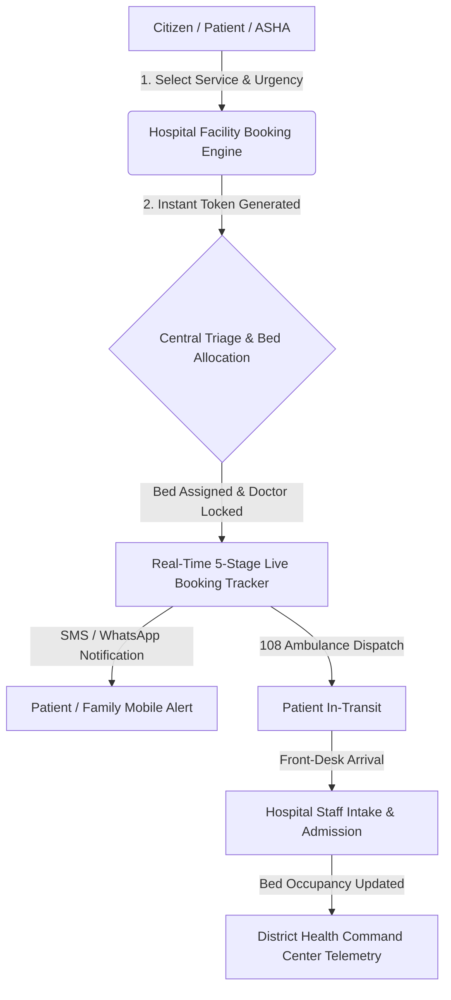
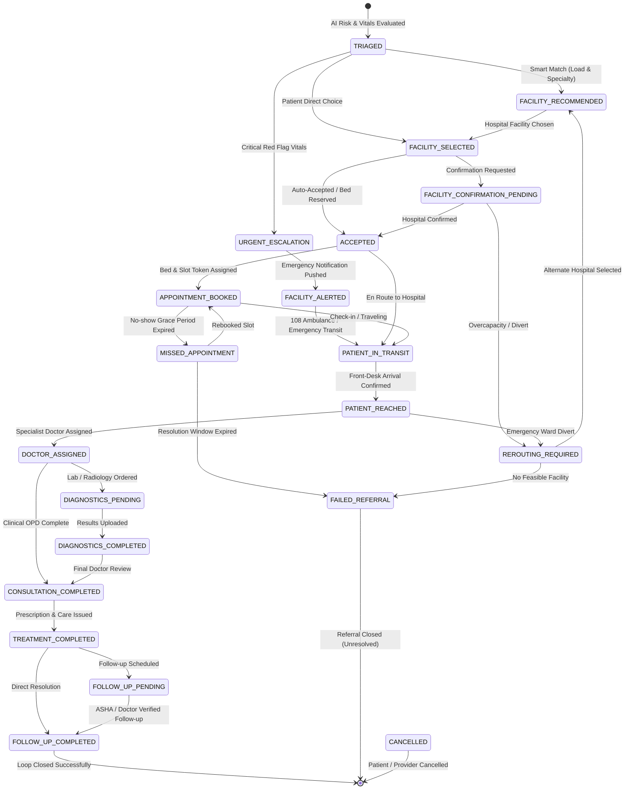

# 🏥 SwasthyaSetu (स्वास्थ्य सेतु) & HealthNexus Platform
> **AI-Assisted Rural Healthcare Coordination, 21-State Closed-Loop Referral Engine & Longitudinal Patient EHR Platform**  
> **Problem Statement ID:** 26133 | **Theme:** MedTech / HealthTech | **Smart India Hackathon 2026**  
> **Government of Maharashtra** — Maharashtra State Innovation Society (MSInS)

---

## 🌟 Overview & Core Differentiator

**SwasthyaSetu** addresses the single biggest systemic breakdown in rural public healthcare delivery: **the referral black hole**. In rural healthcare networks, patients frequently get referred between Sub-Centres (SC), Primary Health Centres (PHC), Community Health Centres (CHC), Sub-District Hospitals (SDH), and District Hospitals (DH) with fragmented physical paper slips and zero tracking of whether the patient ever reached the facility or received completed treatment.

SwasthyaSetu bridges this gap with an **offline-first, 21-state closed-loop referral state machine**, **smart capacity-aware Hospital Facility matching**, **AI clinical risk triage with deterministic safety clamps**, **citizen bed & service booking with live timeline tracking**, **internal doctor queue assignment**, **longitudinal EHR & multimodal lab report summarization**, and **cryptographically verifiable SHA-256 audit chaining**.

---

## 🎯 User Personas & Dual-Entry Pathways

1. **ASHA / ANM / Caregiver Hub**:
   - Built for low-connectivity rural catchments with offline SQLite queuing and idempotent bi-directional sync.
   - Quick household patient registration, vitals logging, red-flag emergency escalation, household family proxy access, and Day-7 follow-up verification.
2. **Patient Self-Service Route**:
   - For smartphone citizens to self-register, describe symptoms, receive AI risk tiering, book beds/services at capable hospitals, and track active referrals live.
3. **Doctor Clinical OPD Portal**:
   - Triage queue management, longitudinal patient EHR access, Guardian AI drug-drug interaction safety checks, digitally signed prescriptions, and diagnostics ordering.
4. **Hospital Facility & Bed Command Hub**:
   - Real-time hospital operational load meters (General Inpatient, ICU/Ventilator, Oxygen, NICU), citizen bed/service booking engine, live 5-stage booking tracker, and emergency diversion protocols.
5. **District Health Command Center (Admin Oversight)**:
   - 4-module executive command center with 12 Executive KPIs, Referral Pipeline Bottleneck detection, Facility Telemetry Heatmap, and AI Governance & Cryptographic Audit Ledger.

---

## 🏥 Hospital Facility: Redesigned Architecture & Capabilities

The **Hospital Facility** module has been engineered as a unified, transparent healthcare infrastructure and intake system:



### 1. 📋 Comprehensive Hospital Facilities Directory
Every hospital profile provides complete transparency into its infrastructure, specialized equipment, and clinical workforce:
- **24x7 Level-1 Emergency & Trauma Bay**: 4 Resuscitation bays, cardiac defibrillators, point-of-care ultrasound (POCUS), and on-call trauma surgeons.
- **Intensive Coronary Care Unit (ICCU / ICU)**: Advance ventilator-supported beds with 24x7 intensivist and continuous cardiac monitoring.
- **Neonatal & Pediatric Intensive Care (NICU)**: Warmers, phototherapy units, and neonatal CPAP ventilators.
- **High-Flow Oxygen Wards**: Dedicated Liquid Medical Oxygen (LMO) cryogenic tanks and PSA generator plants delivering 99.5% medical oxygen pipeline.
- **Advanced Diagnostic Radiology**: 128-Slice Multidetector CT, 1.5 Tesla MRI, 3D Ultrasound, and Digital X-Ray.
- **24x7 In-House Blood Bank & Component Separation**: Platelets, Fresh Frozen Plasma (FFP), and Packed Red Blood Cells (PRBC).
- **Central Pathology & Molecular Lab**: Automated biochemistry, lipid panels, hematology, and viral RT-PCR tests.
- **Hemodialysis Unit**: High-flux dialysis stations with dedicated medical RO water filtration.

### 2. 🛏️ Citizen / Patient Bed & Service Booking Engine
Patients, caregivers, and ASHA workers can directly book hospital infrastructure without standing in queues:
- **Direct Service Selection**: Book ICU Beds, Oxygen-Supported Beds, General Inpatient Beds, NICU Beds, CT/MRI Radiology Scans, Dialysis Sessions, or Specialist OPD Consultations.
- **Clinical Urgency Triage**: Flag cases as `EMERGENCY_CRITICAL` (immediate resuscitation), `URGENT_HIGH` (intake within 2 hours), or `ROUTINE`.
- **ABHA / ABDM Integration**: Automatic linkage with patient ABHA address (`name@abdm`) and digital health records.
- **Unique Booking Token**: Generates verifiable tokens (e.g., `HOSP-PUN-84920`) with instant printable/shareable confirmation passes.

### 3. 📡 Real-Time 5-Stage Live Booking Tracker & Status Updates
Continuous transparency for patients and families from booking submission to hospital admission:
1. **`BOOKING_SUBMITTED`**: Request received and logged via Swasthya Citizen Gateway.
2. **`TRIAGE_VERIFIED`**: Medical Officer confirms clinical urgency level and required ward.
3. **`BED_RESERVED`**: Specific bed number (e.g., `Ward-B, Bed #12` or `ICU-Bed #04`) and attending specialist locked in.
4. **`PATIENT_IN_TRANSIT`**: 108/102 ambulance coordinates dispatched with real-time ETA updates.
5. **`ADMITTED_ACTIVE_CARE`**: Patient arrives at emergency bay and active clinical care commences.
- **Multi-Channel Alerts**: Automated SMS and WhatsApp status dispatch to the patient's registered mobile number at every milestone.

### 4. ⚡ Hospital Staff Operations & Telemetry Grid
Hospital coordinators and triage staff manage inbound flow in real-time:
- **Live Bed Telemetry Gauges**: Real-time tracking of occupied, reserved, and free beds across ICU, Oxygen, General, and NICU wards.
- **Inbound Admissions Queue**: 1-click status transitions (`Admit to Bed`, `Assign Doctor`, `Divert/Reroute`, `Mark Discharged`).
- **Synchronized District Telemetry**: Automatic feed to the District Health Command Center for cross-district capacity balancing.

---

## 🔄 The Canonical 21-State Closed-Loop Referral Machine



---

## 🚀 Core Features Matrix

### 1. 📋 Closed-Loop Referral Lifecycle
- **21-State State Machine**: Invariant-enforced transitions covering routine, urgent emergency, overcapacity rerouting, cancellation, diagnostics, and follow-up loops.
- **Hospital-Centric Routing**: Referrals target capable healthcare facilities; internal coordinators assign specific doctors based on real-time OPD loads.

### 2. 🏥 Smart Hospital Facility Matching & Availability Decay
- **Multi-Tier Directory**: Sub-Centres, PHCs, CHCs, Sub-District Hospitals, and District Hospitals.
- **Freshness-Aware Load Meter**: Dynamic operational load scoring (0–100%) incorporating time-based exponential decay when telemetry is older than 60 minutes.
- **24x7 Emergency Tagging**: Direct routing for trauma, high-risk pregnancy, and cardiac emergency cases.

### 3. 🤖 AI Clinical Decision Support & Safety Boundary
- **Clamped Vitals Triage**: Evaluates BP, SpO2, Heart Rate, Respiratory Rate, Temperature, and Pregnancy. Deterministic clinical rules guarantee critical red-flag vitals (e.g. SpO2 < 90%, BP > 180/110) cannot be downgraded by LLM outputs.
- **Zero Prescribing Authority**: AI microservice provides strictly educational summaries and differential decision support. All prescriptions require verified doctor sign-off.
- **Circuit Breaker Protection**: `AiCircuitBreaker` pattern prevents cascading backend failures when remote AI models face latency or outages, instantly falling back to local deterministic rule engines.

### 4. 📄 Longitudinal EHR & Prescription Safety
- **Multimodal Lab Report Summarizer**: OCR extraction and educational breakdown of lab values (Hb, WBC, Platelets, Sugar) with normal range comparisons.
- **Guardian AI Drug Interaction Check**: Cross-references prescribed medicines against known patient allergies and existing medications to flag contraindicated drug combinations.

### 5. 🔐 Cryptographic Ledger & Data Governance
- **SHA-256 Audit Chain**: Every state transition and clinical event creates an immutable block cryptographically linked to the previous block hash.
- **Role-Based Access Control (RBAC)**: Strict role separation across `patient`, `health_worker`, `doctor`, `facility_staff`, `facility_coordinator`, and `admin`.

---

## 🛠️ Technology Stack

| Component | Technology | Description |
| :--- | :--- | :--- |
| **Backend API** | Node.js (v18+) + Express | Clean layered architecture (Controllers, Services, Domain, Repositories) |
| **Database & Identity** | Supabase (PostgreSQL 16) | UUID primary keys, Row Level Security, JSONB audit storage |
| **AI Microservice** | Python FastAPI / Gemini SDK | Clinical decision support, OCR extraction, circuit breaker wrapper |
| **Frontend Web** | React 19 + Vite + Tailwind CSS | Responsive web application for patients, doctors, hospital staff, and administrators |
| **Mobile Runtime** | Capacitor 8 | Native Android wrapper for field workers and patients |
| **Offline Cache** | SQLite / Local File System | Zero-data-loss queue for low-bandwidth rural operations |
| **API Documentation** | OpenAPI 3.0 (Swagger UI) | Interactive API exploration at `/api-docs` |

---

## ⚡ Quick Start & Verification Guide

### 1. Prerequisites
- **Node.js**: v18+ (Node 20+ LTS recommended)
- **Git**

### 2. Installation
```bash
# Clone the repository
git clone https://github.com/MrAditya-Singh/Swasthya.git
cd Swasthya/backend

# Install backend dependencies
npm install
```

### 3. Environment Configuration
Copy the sample environment file and adjust keys if connecting to custom Supabase instances:
```bash
cp .env.example .env
```

### 4. Running the Automated Test Suite
```bash
# Run all unit, integration, and E2E tests (21/21 suites)
npm test
```

### 5. Starting the Backend & Frontend Servers
```bash
# Backend (Port 8000)
cd backend && npm start

# Frontend (Port 5173)
cd frontend_react && npm run dev
```

---

## 📜 License & Acknowledgements
Developed for the **Smart India Hackathon 2026** (Problem Statement 26133) in collaboration with the **Government of Maharashtra** and **Maharashtra State Innovation Society (MSInS)**.
